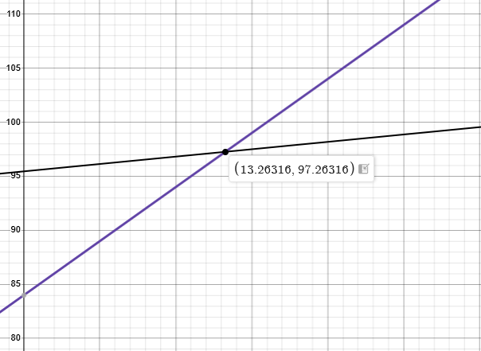
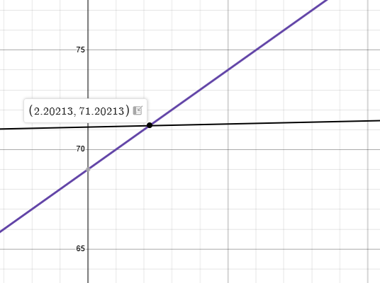
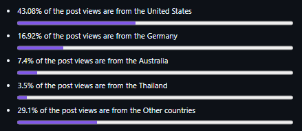

> [!NOTE]
> This research has been paused indefinitely by resolution of the research team and relevant experts.

# social-experiment-early-2026-report (WIP)

A report document for researching how people reacting a critical mental health user/posts to content that contain sensitive content.

This research will contribute to advancements in medical science, computer science, law, and related fields.

> [!NOTE]
> This research still on going and the readme content can be changed at any time.

> [!NOTE]
> This research sample contain sensitive content. All sensitive contents just for educational purposes only. All sensitive contents are removed Mar 14, 2026 13:23 (UTC+7).
>
> The researchers and Ponlponl123 are not support pedophilia and will continue to fight against it to the end.

> [!NOTE]
> Full published PDF report will be available when the research is completed and verified by the research team and third party person.

## Disclamer

All data collected in this research is for educational purposes only. The data is not intended to be used for any other purpose.

All contents and sensitive contents are removed Mar 14, 2026 13:23 (UTC+7).

**The researchers and Ponlponl123 are not support pedophilia and will continue to fight against it to the end.**

## Table of Contents

- [Introduction](#introduction)
- [Research Questions](#research-questions)
- [Research Methodology](#research-methodology)
- [Research Findings](#research-findings)
- [Definations](#definations)
- [Research Sample](#research-sample)
- [Research Limitations](#research-limitations)
- [Why r/desktops?](#why-r-desktops)
- [Risks and protective factors](#risks-and-protective-factors)
- [Conclusion](#conclusion)
- [Discussion](#discussion)
- [Sample Environment](#sample-environment)
- [References](#references)
- [Concluding](#concluding)

## Introduction

This is a research project to understand how people react to a critical mental health user/posts on social media. The research is ongoing and will be updated as new data is collected.

## Research Questions

1. How do people react to a critical mental health user/posts on social media?
2. What are the common reactions to a critical mental health user/posts?
3. How do people perceive a critical mental health user/posts?
4. What are the common themes in the reactions to a critical mental health user/posts?
5. How do people react to a critical mental health user/posts from different demographics?
6. How much social can cause to a critical mental health person?
7. How do mental health user/posts affect the mental health of the people who see them?
8. How do people react to a critical mental health user/posts from different social media platforms?
9. Why mental health person are critical?
10. Why people are critical to mental health person?
11. How people can increase their mental health?
12. How social media can help people to increase their mental health?
13. How do people react to a critical mental health user/posts from different countries?
14. How do we can help people who are critical to mental health person?
15. How do we can reduce the social impact of a critical mental health person?

## Research Methodology

The research will be conducted using a combination of qualitative and quantitative methods. The qualitative method will involve analyzing the reactions to a critical mental health user/posts on social media. The quantitative method will involve surveying people on their reactions to a critical mental health user/posts.

## Research Findings

The research findings will be presented in a report format. The report will include the following sections:

1. Introduction
2. Research Methodology
3. Research Findings
4. Discussion
5. Conclusion
6. References

## Definations

### Mental health

Mental health is a state of mental well-being that enables people to cope with the stresses of life, realize their abilities, learn and work well, and contribute to their community. It has intrinsic and instrumental value and is a basic human right.

Mental health exists on a complex continuum, which is experienced differently from one person to the next. At any one time, a diverse set of individual, family, community and structural factors may combine to protect or undermine mental health. Although most people are resilient, people who are exposed to adverse circumstances are at higher risk of developing a mental health condition.

Mental health conditions include mental disorders and psychosocial disabilities as well as other mental states associated with significant distress, impairment in functioning, or risk of self-harm. Many mental health conditions can be effectively treated at relatively low cost, yet health systems remain significantly under-resourced and treatment gaps are wide all over the world.

Mental health is a fundamental human right and a component of health.

### Pedophilia

Pedophilia, in the context of men who have sexually offended against children (PSOC), is characterized not by an exclusive preference for children, but by greater sexual interest in children combined with reduced sexual interest in adults.

## Research Sample

The research sample will be collected from reddit posts and comments.

1. This post is talking about a user who is critical of mental health and want to share there desktop on r/desktops with weird background that sensitive on internet.

   ref: https://www.reddit.com/r/desktops/comments/1rspyka/my/

2. This post is talking about a user as the same user as sample-1 is critical of mental health and want to share there desktop on r/desktops in another desktop environment.

   ref: https://www.reddit.com/r/desktops/comments/1rsr209/my_but_dark

### User back stories

For those samples i've used the real user with digital footprint on internet (my personal account), and the stories was the user who is having there mental health and trying to fight with there in order to recover. and early janurary 2026, the user was having **online scams** [1](#online-scams) involving online shopping. that made him feel like he was a lot of stress and anxiety and was trying to find a way to recover. next after ~1 month, the user was having some **recovered by there family and friends by playing a game** [2](#related-why-mental-keep-continuing) with them. then early march 2026, the user was made there desktop environment looking glass on windows 11. so he was more happiness from find out non-build-in windows 11 customization and able to recover from the stress and anxiety by that method. and the [**first reddit post**](https://www.reddit.com/r/MoeDesktop/comments/1rm9ldi/my_windows/) was made on [r/MoeDesktop](https://www.reddit.com/r/MoeDesktop/) March 6, 2026. the user being used sensitive desktop wallpaper from this situation with no-comment but the user was so happy with upvotes and views from the community. then 7 days or a week later, the user was made another post on [r/desktops](https://www.reddit.com/r/desktops/) with same desktop environment. but now the user got [negative comments with highest views](#second-post-with-negative-comments-and-highest-views) from the community.

### Related why mental keep continuing

#### Online scams

Online scams are a common issue that people face. The user was scammed by a fake online shopping website. The user lost a lot of money and was left with a lot of stress and anxiety. The user was trying to find a way to recover.

#### Family and friends support

The user was supported by there family and friends. The user was able to recover from the stress and anxiety by playing a game with them. The user was able to find a way to recover from the stress and anxiety with comfort and most easy way.

#### First post with positive upvotes and views

The user was able to recover from the stress and anxiety by sharing there desktop on r/MoeDesktop. The user was able to find a way to recover from the stress and anxiety with positive upvotes and views from the community.

#### Second post with negative comments and highest views

Negative comments for who was mental health that will make them become more overthinking and panic instantly when read it.

Then the ignition point is highest views from the community. that will make people who was mental health to be more Panicking, anxiety, and significantly increased overthinking.

### After reddit account got deleted

The user was deleted there reddit account. The user was not able to recover from the there social media but in the same time the stress and anxiety was increased and non-stopping until healing by closest and comfort person.

### Post upvotes ratio

- **Sample-1**
  - Upvotes 84
  - Downvotes 13
  - Total 97

  

  
<b>sample-1</b> updated on 2026-03-14 13:23 (UTC+7)

- **Sample-2**
  - Upvotes 69
  - Downvotes 2
  - Total 71

  

  
<b>sample-2</b> updated on 2026-03-14 13:23 (UTC+7)

### Post views ratio

- **Sample-1**

  

  
<b>sample-1</b> updated on 2026-03-14 13:23 (UTC+7)

## Research Limitations

The research has some limitations. The research is limited to a specific social media platform. The research is limited to a specific time period. The research is limited to a specific user/posts.

## Why [r/desktops](https://www.reddit.com/r/desktops/)?

Because [r/desktops](https://www.reddit.com/r/desktops/) are medium-large reddit community with 40K weekly visitors and 1.5K weekly contributions. So the desktop community is having a lot of people who loved to share their desktop and discusting about their desktop/pc environment not for other purposes. and it will be more interesting and more engaging with pure thinking more than a community that discusses specifically because the shared desktop picture is the same subject but it's having sensitive content in there picture.

## Risks and protective factors

Mental health is influenced by a wide range of factors, including:

- Genetic factors
- Brain chemistry
- Personality
- Relationships and social interactions
- Life experiences
- Environment
- Culture
- Gender
- Age
- Health status
- Lifestyle
- Social and economic factors

Mental health is influenced by risks and protective factors at many levels. Individual factors—such as emotional skills, substance use, and genetics—can increase vulnerability, while social and environmental issues like poverty, violence, and inequality also raise the risk.

These risks can occur at any stage of life, but those in early childhood are especially harmful. For example, harsh parenting and bullying can significantly affect a child’s mental health.

Protective factors help build resilience. They include strong social and emotional skills, supportive relationships, quality education, decent work, safe communities, and strong social connections.

Both risks and protections exist at local and global levels. Personal, family, and community challenges interact with broader threats like economic crises, disease outbreaks, humanitarian emergencies, forced displacement, and climate change.

No single factor determines mental health outcomes; rather, the interaction of many factors over time shapes a person’s mental well-being.

## Conclusion

The research is ongoing. The research is limited to a specific social media platform. The research is limited to a specific time period. The research is limited to a specific user/posts.

## Discussion

The research is ongoing.

## Sample Environment

So after im deleted that reddit account, then im tring to make other profile from other platform private too. to make user look interesting and make them more discussing about their life.

## References

[1] https://www.reddit.com/r/desktops/comments/1rspyka/my/

[2] https://www.reddit.com/r/desktops/comments/1rsr209/my_but_dark

[3] https://www.reddit.com/r/MoeDesktop/comments/1rm9ldi/my_windows/

[4] https://www.medparkhospital.com/disease-and-treatment/mental-health

[5] https://www.rama.mahidol.ac.th/ramachannel/article/%E0%B9%82%E0%B8%A3%E0%B8%84%E0%B8%88%E0%B8%B4%E0%B8%95%E0%B9%80%E0%B8%A7%E0%B8%8A-5-%E0%B9%82%E0%B8%A3%E0%B8%84%E0%B8%AA%E0%B8%B3%E0%B8%84%E0%B8%B1%E0%B8%8D%E0%B8%97%E0%B8%B5%E0%B9%88%E0%B8%84/

[6] https://www.bangpakokrangsit.com/care_blog/view/117

[7] https://www.who.int/news-room/fact-sheets/detail/mental-health-strengthening-our-response

[8] https://www.sciencedirect.com/science/article/pii/S1359178922000945

# Concluding

Mental health is influenced by risks and protective factors at many levels. Individual factors—such as emotional skills, substance use, and genetics—can increase vulnerability, while social and environmental issues like poverty, violence, and inequality also raise the risk.

And the researchers and Ponlponl123 are not support pedophilia and will continue to fight against it to the end.

> [!NOTE]
> **The research is ongoing.**
